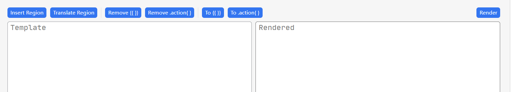

## Usage

1. Input the template text into the left-side textarea.
  - The left-side textarea supports tab indentation, Shift+Tab unindentation, and Enter for automatic indented newline.
2. Click the "render" button at the top-right corner.
3. The rendered result will be shown in the right textarea.

## Two Formats

SiYuan supports two template formats:

1. The vanilla Golang template format: `{{ }}`.
2. The SiYuan built-in revised template format: `.action{}`.

    > Mainly because the `{{ }}` syntax conflicts with the `embed block` syntax.

This plugin allows you to quickly convert between different formats by clicking the top-left buttons `To .action` and `To {{ }}`.

For example, with the following input into the textarea:

```code
{{ now }}
```

And click the "To .action", it will be converted to:

```code
.action{ now }
```

## Action Region Syntax

It is not easy to write `.action` or `{{}}` on each line, especially when you want to test a very long template.

For convenience, this plugin offers a **custom** region syntax like this:

```
.startaction
$x := now
$x.Year
add 1 3 | sub 5
.endaction
```

Each line placed within the `.startaction ... .endaction` will be implicitly wrapped with `{{ }}` before rendering.

**Notice**! You cannot use this syntax in SiYuan's template system. Please click the "Translate Region" button at the top-right before you want to apply the template you are testing.

## Button Function Descriptions



- Region Functions
  - `Insert Region`: Click to insert a `.startaction ... .endaction` region around the cursor (or selected text).
  - `Translate Region`: Convert the `.startaction ... .endaction` region to `.action{}` template syntax for easy copying and pasting.
- Remove Functions
  - `Remove {{}}`: Remove all `{{ }}` decorators.
  - `Remove .action{}`: Remove all `.action{}` decorators.
- Format Conversion
  - `To {{}}`: Convert `.action{}` to `{{ }}` decorators.
  - `To .action{}`: Convert `{{ }}` to `.action{}` decorators.
- Render: Render the template text in the left text area to the result in the right text area.

