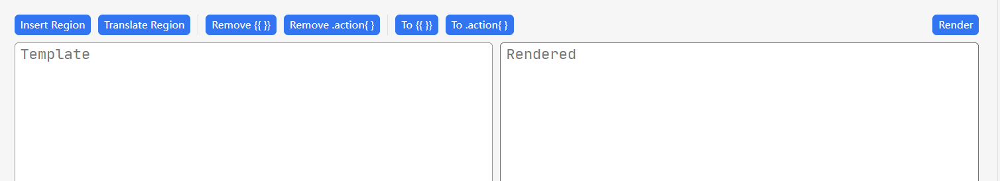

## 使用方法

1. 将模板文本输入到左侧文本区域。
   - 左侧文本框支持 tab 缩进、Shift+Tab 反缩进、Enter 自动缩进换行功能
2. 点击右上角的"Render"按钮。
3. 渲染结果将显示在右侧文本区域。

## 两种格式

思源笔记支持两种模板格式:

1. 原生 Golang 模板格式: `{{ }}`。
2. 思源笔记内置的修订模板格式: `.action{}`。

    > 主要是因为 `{{ }}` 语法与 嵌入块的 markdown 语法冲突。

本插件允许你通过点击左上角的 "To .action" 和 "To {{ }}" 按钮快速转换不同格式。

例如, 在文本区域输入以下内容:

```code
{{ now }}
```

然后点击 "To .action", 它将被转换为:

```code
.action{ now }
```

## Action 区域语法

在每一行都写 `.action` 或 `{{}}` 很不方便, 尤其是想测试一个很长的模板时就更令人难受了。

为了方便起见, 本插件提供了一种 **自定义** 区域语法:

```code
.startaction
$x := now
$x.Year
add 1 3 | sub 5
.endaction
```

在 `.startaction ... .endaction` 之间的每一行都将在渲染前被隐式地包裹在 `{{ }}` 中。

**注意**! 你不能在思源笔记的模板系统中使用这个语法。点击右上角的 "Translate Region" 按钮将其转换为能被思源正确识别的格式。

## 功能按钮说明



- Region 功能
  - `Insert Region`: 点击后，在光标处（或者选中的文本）周围插入一个 `.startaction ... .endaction` 区域。
  - `Translate Region`: 将 `.startaction ... .endaction` 区域转换为 `.action{}` 模板语法，方便直接粘贴使用。
- Remove 功能
  - `Remove {{}}`: 移除所有的 `{{ }}` 修饰符
  - `Remove .action{}`: 移除所有的 `.action{}` 修饰符
- 格式转换
  - `To {{}}`: 将 `.action{}` 转换为 `{{ }}` 修饰符
  - `To .action{}`: 将 `{{ }}` 转换为 `.action{}` 修饰符
- Render：将左侧文本区域的模板文本渲染为右侧文本区域的结果。
